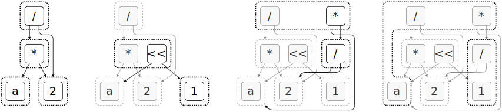

# Statement of Need

<!-- The Julia programming language is a fresh approach to technical computing [@bezanson2017julia], disrupting the popular conviction that a programming language cannot be very high level, easy to learn, and performant at the same time. One of the most practical features of Julia is the excellent metaprogramming and macro system, allowing for programmatic generation and manipulation of Julia expressions as first-class values in the core language, with a well-known paradigm similar to LISP idioms such as Scheme,
a programming language property colloquially referred to as *homoiconicity*. -->

The Julia programming language is a fresh approach to technical computing [@bezanson2017julia], disrupting the popular conviction that a programming language cannot be high level, easy to learn, and performant at the same time. One of the most practical features of Julia is the excellent metaprogramming and macro system, allowing for *homoiconicity*: programmatic generation and manipulation of expressions as first-class values, a well-known paradigm similar to several LISP idioms such as Scheme.

We introduce Metatheory.jl: a general purpose metaprogramming and algebraic computation library for the Julia programming language, designed to take advantage of the powerful reflection capabilities to bridge the gap between symbolic mathematics,
abstract interpretation, equational reasoning, optimization, composable compiler transforms, and advanced homoiconic pattern matching features. Intuitively, Metatheory.jl transforms Julia expressions in other Julia expressions at both compile and run time. This allows Metatheory.jl users to perform customized and composable compiler optimization specifically tailored to single, arbitrary Julia packages. Our library provides a simple, algebraically composable interface to help scientists in implementing and reasoning about all kinds of formal systems, by defining concise rewriting rules as syntactically valid Julia code.

<!-- Rewrite rules are defined as regular Julia expressions, manipulating other syntactically valid Julia expressions: since Julia supports LaTeX-like abbreviations of UTF8 mathematical symbols as valid operators and symbols,
rewrite theories in Metatheory.jl can bear a strong structural and visual resemblance to mathematical formalisms encountered in paper literature. -->

<!-- Theories can then be executed through two, highly composable, rewriting backends. The first backend relies on a *classic* fixed-point recursive iteration of AST, with a match-and-replace algorithm built on top of the [@matchcore] pattern matcher. This backend is suitable for deterministic recursive algorithms that intensively use pattern matching on syntax trees, for example, defining an interpreter from operational or denotational semantics. Nevertheless, when using this classical approach, even trivial equational rules such as commutativity and associativity may cause the rewriting algorithm to loop indefinitely, or to return unexpected results. This is known as *rewrite order* and is notoriously recognized for requiring extensive user reasoning about the ordering and structuring of rules to ensure termination. -->

# Summary

Theories can then be executed throught two, highly composable, rewriting backends. The first one, is based just on standard rewriting built on top of the pattern matcher developed in [@matchcore].
Such approach suffers of the usual problems of rewriting systems: even trivial equational rules such as commutativity may lead to non-terminating systems and thus need to be adjusted by some sort of structuring or rewriting order (that is known to require extensive user reasoning).


The other back-end for Metatheory.jl, the core of our contribution, is designed to not require the user to reason about rewriting order by relying on state-of-the-art techniques equality saturation on *e-graphs*, adapted from the `egg` rust library [@egg].
Provided with a theory of equational rewriting rules, defined in pure Julia, *e-graphs* compactly represent many equivalent programs. Saturation iteratively executes an e-graph specific pattern matcher to efficiently compute (and analyze) all possible equivalent expressions contained in the e-graph congruence closure. This latter back-end is suitable for partial evaluators, symbolic mathematics, static analysis, theorem proving and superoptimizers.

<!-- The other back-end for Metatheory.jl, the core of our contribution, is designed to not require the user to reason about rewriting order by employing equality saturation on e-graphs. This backend allows programmers to define equational theories in pure Julia without worrying about rule ordering and structuring, by relying on state-of-the-art techniques for equality saturation over *e-graphs* adapted from the `egg` rust library [@egg].
Provided with a theory of equational rewriting rules, *e-graphs* compactly represent many equivalent programs. Saturation iteratively executes an e-graph specific pattern matcher to efficiently compute (and analyze) all possible equivalent expressions contained in the e-graph congruence closure. This latter back-end is suitable for partial evaluators, symbolic mathematics, static analysis, theorem proving and superoptimizers. -->




The original `egg` library [@egg] is
known to be the first implementation of generic and extensible e-graphs [@nelson1980fast], the contributions of `egg` include novel amortized algorithms for fast and efficient equivalence saturation and analysis.
Differently from the original rust implementation of `egg`, which handles expressions defined as rust strings and data structures, our system directly manipulates homoiconic Julia expressions, and can therefore fully leverage the Julia subtyping mechanism [@zappa2018julia], allowing programmers to build expressions containing not only symbols but all kinds of Julia values.
This permits rewriting and analyses to be efficiently based on runtime data contained in expressions. Most importantly, users can --and are encouraged to-- include type assertions in the left hand of rewriting rules in theories.

One of the project goals of Metatheory, beyond being to be easy to use and composable, is to be fast and efficient: both the first-class pattern matching system and the generation of e-graph analyses from theories rely on RuntimeGeneratedFunctions.jl [@rgf], generating callable functions at runtime that efficiently bypass Julia's world age problem [@belyakova2020world] with the full performance of a standard Julia anonymous function.


## Analyses and Extraction

With Metatheory.jl, modeling analyses and conditional/dynamic rewrites is straightforward: it is possible to check conditions on runtime values or to read and write from external data structures during rewriting. The analysis mechanism described in egg [@egg] and re-implemented in our contribution lets users define ways to compute additional analysis metadata from an arbitrary semi-lattice domain, such as costs of nodes or logical statements attached to terms. Other than for inspection, analysis data can be used to modify expressions in the e-graph both during rewriting steps and after e-graph saturation.

Therefore using the equality saturation (e-graph) backend, extraction can be performed as an on-the-fly e-graph analysis or after saturation. Users
can define their own, or choose between a variety of predefined cost functions for automatically extracting the most fitting expressions from the congruence closure represented by an e-graph.

# Examples

In this example, we build rewrite systems, called `theories` in Metatheory.jl, for simplifying expressions
in the usual commutative monoid of multiplication and the commutative group of addition, and we compose
the `theories` together with a *constant folding* theory. The pattern matcher for the *e-graphs* backend
allows us to use the existing Julia type hierarchy for integers and floating point numbers with an high level
of abstraction. We finally add two simple rules for simplifying fractions, that
for the sake of simplicity, do not check any additional analysis data.
Figure \autoref{fig:egraph} contains a friendly visualization of (a fragment of) the equality saturation process in this
example.
You can see how loops easily appear in the definition of the rewriting rules.
While the classic rewriting backend would loop indefinitely or stop when repeatedly matching these rules,
the *e-graph* backend natively support this level of abstraction and allows the
programmer to completely forget about the ordering and looping of rules.
Efficient scheduling heuristics are applied automatically to prevent instantaneous
combinatorial explosion of the e-graph, thus preventing substantial slowdown of the equality saturation
algorithm.

```julia
using Metatheory
using Metatheory.EGraphs

comm_monoid = @theory begin
  # commutativity
  a * b => b * a
  # identity
  a * 1 => a
  # associativity
  a * (b * c) => (a * b) * c
  (a * b) * c => a * (b * c)
end;

comm_group = @theory begin
  # commutativity
  a + b => b + a
  # identity
  a + 0 => a
  # associativity
  a + (b + c) => (a + b) + c
  (a + b) + c => a + (b + c)
  # inverse
  a + (-a) => 0
end;

# dynamic rules are defined with the `|>` operator
folder = @theory begin
  a::Real + b::Real |> a+b
  a::Real * b::Real |> a*b
end;

div_sim = @theory begin
  (a * b) / c => a * (b / c)
  a::Real / a::Real => 1
end;

t = comm_monoid ∪ comm_group ∪ folder ∪ div_sim ;

g = EGraph(:(a * (2*3) / 6)) ;
saturate!(g, t) ;
extran = addanalysis!(g, ExtractionAnalysis, astsize) ;
ex = extract!(g, extran)
# :a 

```

# Conclusion

Many applications of equality saturation have been recently published, tailoring advanced optimization tasks. Herbie [@panchekha2015automatically]
is a tool for automatically improving the precision of floating point expressions, which recently switched to `egg` as the core rewriting backend. In [@yang2021equality], authors used `egg` to superoptimize tensor signal flow graphs describing neural networks. However, Herbie requires interoperation and conversion of expressions between different languages and libraries. Implementing similar case studies in pure Julia would make valid research contributions on their own. We are confident that a well-integrated and homoiconic equality saturation engine in pure Julia will permit exploration of many new metaprogramming applications, and allow them to be implemented in an elegant, performant and concise way. Code for Metatheory.jl is available in [@metatheory], or at this link [https://github.com/0x0f0f0f/Metatheory.jl](https://github.com/0x0f0f0f/Metatheory.jl).

# Acknowledgements

We acknowledge Max Willsey and contributors for their work on the original `egg` library [@egg], Christopher Rackauckas and Christopher Foster for their efforts in developing RuntimeGeneratedFunctions [@rgf], Taine Zhao for developing MLStyle [@mlstyle] and MatchCore [@matchcore], and Philip Zucker for his original idea of implementing E-Graphs in Julia [@philzuck1; @philzuck2] and support during the development of the project. Special thanks to Filippo Bonchi for a friendly review of a preliminary version of this article.

# References
